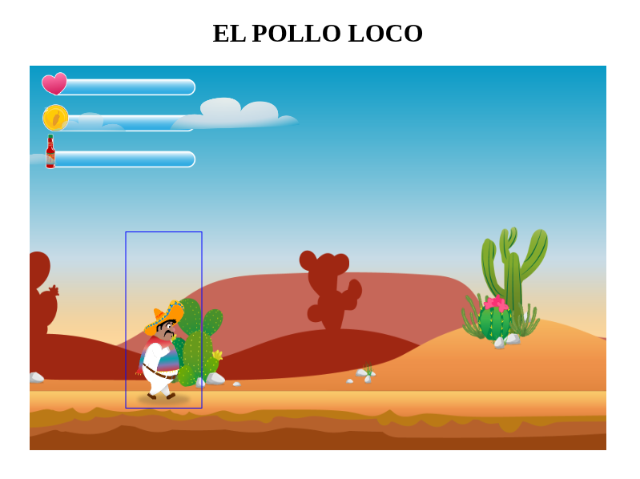

# El Pollo Loco

A browser-based 2D jump-and-run game built with vanilla JavaScript, HTML5 Canvas, and CSS. You play as Pepe — a man on a mission to defeat the end boss and his army of chickens.



## Demo

> Deploy or open `index.html` directly in a browser. No build step required.

## Gameplay

| Action | Key |
|---|---|
| Move right | `→` Arrow Right |
| Move left | `←` Arrow Left |
| Jump | `↑` Arrow Up or `Space` |
| Duck | `↓` Arrow Down |
| Throw bottle | `D` |

- Collect **coins** to increase your score
- Collect **salsa bottles** to fill your throw inventory
- Jump **on top of** chickens to defeat them
- Throw bottles at the **Endboss** to deal damage
- Survive — when your health bar empties, it's game over

## Architecture

The project follows an **OOP class hierarchy** with a single rendering loop via `requestAnimationFrame`.

```
DrawableObject
└── MovableObject
    ├── Character         — player-controlled character with full animation state machine
    ├── Chicken           — standard enemy, patrolling
    ├── Endboss           — triggered enemy with alert/attack phases
    ├── BackgroundObject  — parallax background layer
    ├── Cloud             — decorative, auto-scrolling
    └── StatusBar         — HUD element for health / bottles / coins
```

**Core files:**

| File | Responsibility |
|---|---|
| `js/game.js` | Entry point — initialises canvas, world, and keyboard |
| `models/world.class.js` | Game loop, collision detection, draw cycle |
| `models/character.class.js` | Player input, animation states, physics |
| `models/level.class.js` | Level data container |
| `levels/level1.js` | Enemy, coin, bottle, and background placement |
| `js/assets.js` | Centralised image/audio asset registry |

## Project Structure

```
loco-app/
├── index.html
├── style.css
├── js/
│   ├── game.js
│   └── assets.js
├── models/
│   ├── drawable-object.class.js
│   ├── movable-object.class.js
│   ├── character.class.js
│   ├── chicken.class.js
│   ├── endboss.class.js
│   ├── cloud.class.js
│   ├── background-object.class.js
│   ├── status-bar.class.js
│   ├── keyboard.class.js
│   ├── level.class.js
│   └── world.class.js
├── levels/
│   └── level1.js
├── img/
└── audio/
```

## Getting Started

```bash
# Clone the repository
git clone https://github.com/<your-username>/el-pollo-loco.git
cd el-pollo-loco/loco-app

# Open in browser — no server needed for local development
open index.html         # macOS
xdg-open index.html     # Linux
start index.html        # Windows
```

> For features that require a local server (e.g. audio autoplay policies), use:
> ```bash
> npx serve .
> ```

## Browser Support

| Browser | Status |
|---|---|
| Chrome / Edge (latest) | ✓ Supported |
| Firefox (latest) | ✓ Supported |
| Safari (latest) | ✓ Supported |
| Mobile (landscape) | ✓ Touch controls |

## Contributing

1. Fork the repository
2. Create a feature branch: `git checkout -b feature/my-feature`
3. Commit with a descriptive message: `git commit -m "feat: add sleep animation trigger"`
4. Push and open a Pull Request

## Author

**Viktor Wilhelm**

[](mailto:hello@viktor-wilhelm.de)
[](https://www.linkedin.com/in/viktor-wilhelm-802b4a332/)

## License

This project was created as part of the [Developer Akademie](https://developerakademie.com) curriculum. Game assets are provided by the course and remain the property of their respective owners.
